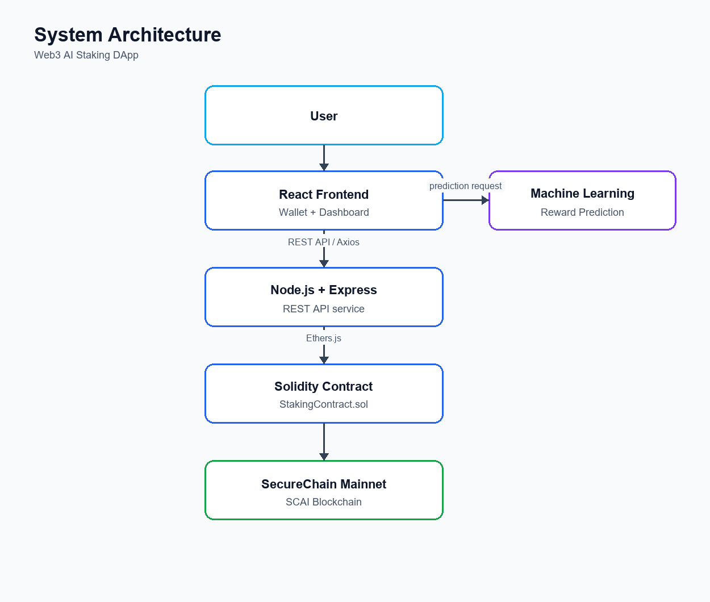
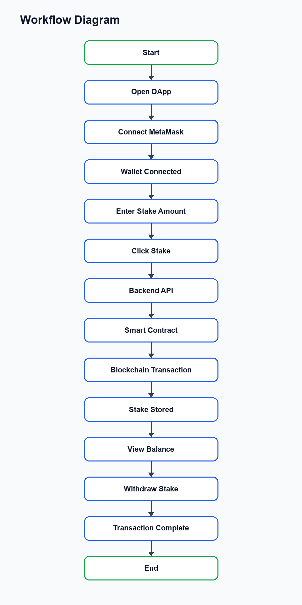
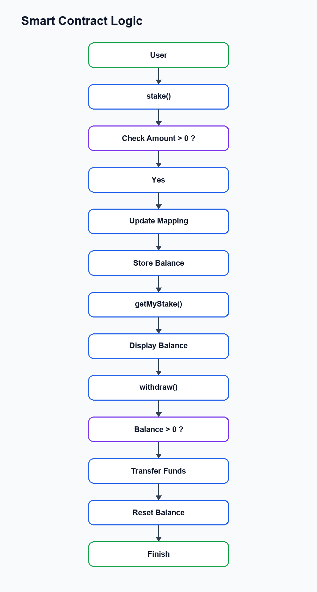

# System Architecture Design

# Web3 AI Staking DApp

## Overview

The Web3 AI Staking DApp follows a layered architecture that integrates a React frontend, Node.js backend, Solidity smart contracts, and the SecureChain (SCAI) blockchain. The application also includes a Machine Learning module for reward prediction.

The architecture separates responsibilities between the user interface, backend services, blockchain layer, and AI module.

---

## System Architecture

---

## Workflow Diagram

---

## Smart Contract Logic

---

## System Components

## 1. Frontend Layer

Technology:

- React.js
- Axios
- Ethers.js

Responsibilities:

- User interface
- Wallet connection
- Stake form
- Display balance
- Display reward prediction
- Send API requests

---

## 2. Backend Layer

Technology:

- Node.js
- Express.js

Responsibilities:

- Handle REST APIs
- Process requests
- Connect frontend with blockchain
- Validate user input

---

## 3. Smart Contract Layer

Technology:

- Solidity

Responsibilities:

- Store staking balances
- Accept staking transactions
- Handle withdrawals
- Maintain blockchain state

---

## 4. Blockchain Layer

Technology:

- SecureChain (SCAI)

Responsibilities:

- Execute smart contracts
- Store transaction history
- Verify blockchain transactions
- Maintain decentralization

---

## 5. Machine Learning Module

Technology:

- Python
- Scikit-learn

Responsibilities:

- Analyze staking data
- Predict staking rewards
- Generate reward estimates

---

## Data Flow

1. User connects MetaMask wallet.
2. React application sends requests to the backend.
3. Backend communicates with the deployed smart contract.
4. Smart contract records transactions on the SCAI blockchain.
5. Machine Learning module predicts expected staking rewards.
6. Results are displayed on the frontend.

---

## Smart Contract Logic

The staking smart contract contains three primary functions.

## stake()

Purpose:

Allows users to deposit cryptocurrency into the staking contract.

Input:

- Stake amount

Output:

- Updates the user's staking balance.

---

## getMyStake()

Purpose:

Returns the current staking balance of the connected wallet.

Input:

- Wallet address

Output:

- Current stake amount

---

## withdraw()

Purpose:

Transfers all staked funds back to the user.

Input:

- None

Output:

- Stake balance becomes zero.
- Funds are transferred to the wallet.

---

## Security Considerations

The contract includes basic validation mechanisms.

- Prevent zero-value staking.
- Restrict withdrawals to the owner's stake.
- Reset balance before transferring funds.
- Store balances using mappings.

---

## Advantages of the Architecture

- Modular design
- Easy to maintain
- Scalable
- Secure
- Supports future feature expansion
- Clean separation between frontend, backend, blockchain, and AI modules

---

## Conclusion

The proposed architecture provides a complete full-stack Web3 application that combines blockchain technology, decentralized smart contracts, backend APIs, React frontend, and Machine Learning into a single scalable system.
