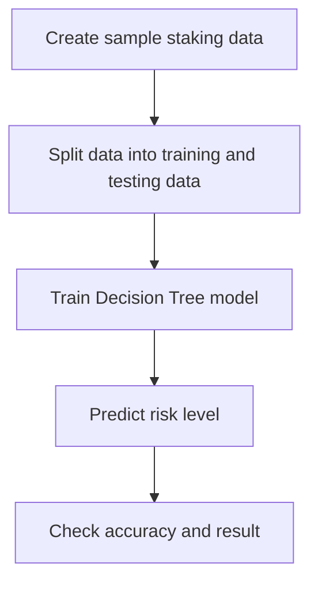

# ML Mini-Experiment

## Topic

This mini-experiment uses machine learning to classify a wallet's staking behavior into a simple risk level.

The goal is not to build a production AI system. The goal is to show how AI can support a staking DApp by giving a basic signal about user staking patterns.

## Problem Statement

In a staking DApp, some users may stake regularly and for a long time, while others may stake for a very short time or withdraw quickly.

The experiment predicts:

| Output | Meaning |
| --- | --- |
| Low Risk | User has stable staking behavior |
| Medium Risk | User has average staking behavior |
| High Risk | User has short or unstable staking behavior |

## Dataset

I used a small sample dataset created inside the notebook.

| Feature | Meaning |
| --- | --- |
| stake_amount | Amount staked by the user |
| staking_days | Number of days the user keeps tokens staked |
| previous_withdrawals | Number of previous withdrawals |
| wallet_age_days | Age of wallet in days |

## Model Used

I used a Decision Tree Classifier because it is easy to understand and explain.

## Experiment Flow

## Steps

1. Import Python libraries.
2. Create sample staking data.
3. Split data into input features and output labels.
4. Train a Decision Tree model.
5. Test the model.
6. Print accuracy and sample prediction.

## Result

The model can classify basic staking behavior into low, medium, and high risk categories.

This result is only for learning and demonstration. A real project should use actual blockchain transaction data and more testing.

## How This Helps the DApp

| DApp Area | ML Use |
| --- | --- |
| User analysis | Understand staking behavior |
| Risk signal | Detect unstable staking patterns |
| Dashboard | Show simple AI-based insights |
| Future upgrade | Use real wallet transaction history |

## Limitations

| Limitation | Reason |
| --- | --- |
| Small dataset | Data is manually created for demo |
| Not production-ready | Needs real blockchain data |
| Simple model | Used for easy explanation |
| No live API connection | ML is separate from DApp for this task |

