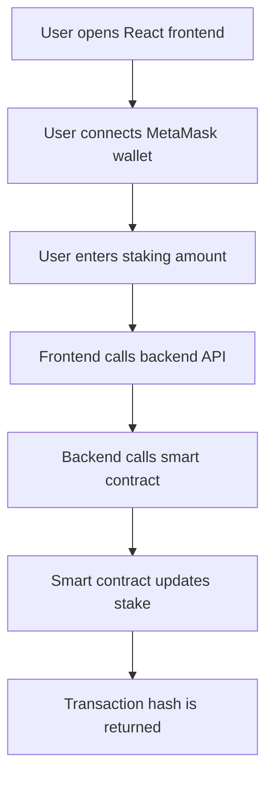

# Security Analysis Report

## Project Name

Web3 AI Staking DApp

## Project Summary

This project is a full-stack staking DApp.

Users can connect a wallet, stake SCAI tokens, check their stake, and withdraw their stake. The project has three main parts:

| Part | Technology | Purpose |
| --- | --- | --- |
| Smart Contract | Solidity | Stores staking amount and handles withdrawal |
| Backend | Node.js and Express | Sends staking requests to the blockchain |
| Frontend | React.js | User interface for wallet connection and staking |

## System Flow



## Smart Contract Reviewed

File reviewed:

```text
contracts/StakingContract.sol
```

Important functions:

| Function | Purpose |
| --- | --- |
| stake | Allows user to send and stake tokens |
| getMyStake | Shows the stake amount of the caller |
| withdraw | Allows user to withdraw their full stake |

## Security Checklist

| Check | Status | Explanation |
| --- | --- | --- |
| Solidity version fixed | Passed | Contract uses Solidity `^0.8.7`, which has built-in overflow checks |
| Stake amount validation | Passed | `stake()` checks that amount is greater than zero |
| Withdraw validation | Passed | `withdraw()` checks that user has a stake |
| State update before transfer | Passed | Stake is set to zero before sending funds |
| Access control | Not required | Each user can only withdraw their own mapped stake |
| Private key handling | Needs care | Backend uses `PRIVATE_KEY`, so it must stay only in `.env` |
| Input validation in backend | Can improve | Backend should validate amount before sending transaction |
| Event logging | Can improve | Contract does not emit events for stake and withdraw |

## Findings

| ID | Risk | Severity | Explanation | Suggested Fix |
| --- | --- | --- | --- | --- |
| S-01 | No event logs | Low | The contract does not emit events after stake or withdraw. This makes tracking harder. | Add `Staked` and `Withdrawn` events |
| S-02 | Backend private key risk | High | If the backend private key is leaked, funds and transactions can be misused. | Store private key only in `.env`, never commit it to GitHub |
| S-03 | Limited backend validation | Medium | Backend accepts `amount` from request body and directly converts it. | Check that amount is a positive number before calling contract |
| S-04 | Centralized transaction signing | Medium | Backend signs staking transactions using one wallet. In a real DApp, users should normally sign transactions from MetaMask. | Use frontend wallet signing for user actions in future |
| S-05 | No emergency pause | Low | If a bug is found, there is no pause function. | Add pause feature only if project becomes production-level |

## Smart Contract Risk Explanation

### Reentrancy

The withdraw function first sets the user stake to zero and then transfers funds.

This is safer than transferring first and updating later.

```text
stakes[msg.sender] = 0;
payable(msg.sender).transfer(amount);
```

Risk level: Low

### Integer Overflow

Solidity version 0.8 and above checks overflow automatically.

Risk level: Low

### Unauthorized Withdrawal

The mapping stores stake by wallet address.

```text
mapping(address => uint256) public stakes;
```

So one user cannot directly withdraw another user's stake.

Risk level: Low

## Backend Security

| Area | Risk | Recommendation |
| --- | --- | --- |
| `.env` private key | High if exposed | Never upload `.env` to GitHub |
| CORS | Medium | For production, allow only frontend domain |
| API input | Medium | Validate amount before transaction |
| Error messages | Low | Avoid exposing detailed internal errors in production |

## Frontend Security

| Area | Risk | Recommendation |
| --- | --- | --- |
| Wallet connection | Low | Check MetaMask is installed |
| User input | Medium | Validate amount before API call |
| Transaction display | Low | Show transaction hash to user |
| Contract address | Medium | Keep correct deployed contract address in one config file |

## Recommended Improvements

| Priority | Improvement | Reason |
| --- | --- | --- |
| High | Keep `.env` out of GitHub | Protect private key |
| High | Add `.gitignore` | Prevent secret files and build files from upload |
| Medium | Validate stake amount in frontend and backend | Avoid invalid transactions |
| Medium | Add contract events | Easier transaction tracking |
| Low | Add more tests | Improve confidence |
| Low | Add pause function | Useful for production safety |

## Conclusion

The staking contract is simple and easy to understand.

The main contract flow is safe for a basic internship-level project because it validates staking amount, checks withdrawal amount, and updates state before transfer.

The biggest real security concern is private key handling in the backend. The private key must never be pushed to GitHub. For a production DApp, user transactions should be signed directly from MetaMask instead of a backend wallet.

